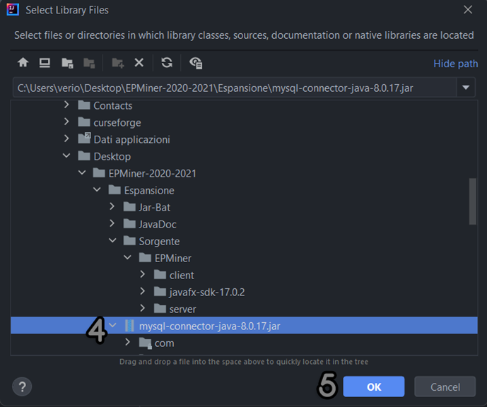

# EPMiner

Testo versione completa del progetto.

# INTRODUZIONE 
Il progetto è stato realizzato da: 

- Domenico Mattia Latrofa
- Natasha Fabrizio
- Francesco Saverio Cassano

Per l’anno accademico 2020/2021. 

Il progetto, denominato "*EPMiner*" consiste nella realizzazione di un sistema client-server per il data mining. Il **client** consente di usufruire del servizio di scoperta remoto e visualizza la conoscenza (pattern) scoperta attraverso una sem- plice interfaccia grafica. Il **server** include funzionalità di data mining per la scoperta di pattern frequenti e pattern emergenti. Il progetto segue le indicazioni descritte dalla professoressa per il server con la sola aggiunta di stampe sull’attività del client connesso. Per l’espansione, il client invece è stato realizzato creando un’interfaccia grafica sfrut- tando le possibilità offerte da **JavaFx** con l’utilizzo di **sceneBuilder** per la realizzazione delle schermate grafiche vere e proprie. L’UML, il JavaDoc, i file jar ed il sorgente del progetto, sono presenti nelle loro corrispettive cartelle. 
# REQUISITI 
Il progetto è stato realizzato con le seguenti dipendenze: 

- [Java 17.0.2 (LTS) ](https://www.oracle.com/java/technologies/downloads/#jdk17-windows)
- [MySql 8.0.17.0 ](https://downloads.mysql.com/archives/get/p/25/file/mysql-installer-community-8.0.17.0.msi) 
- Java Connector (Presente nella stessa cartella) 
- Script Database MySql (Presente nella stessa cartella) 
- Un IDE per lo sviluppo come[ Intellij IDEA ](https://www.jetbrains.com/idea/download/#section=windows)o[ Eclipse.](https://www.eclipse.org/downloads/packages/release/2021-12/r/eclipse-ide-java-developers) 
- SDK JavaFx 17.0.2 (Presente nella stessa cartella) 
# INSTALLAZIONE 
Il programma è stato realizzato e testato con il sistema operativo Windows 10 64 bit. La guida per l’installazione è basata su quest’ultimo. 
## Installare Java 17.0.2
- Bisogna scaricare l’installer (il link è presente nella sezione “**Requisiti**”). 
- L'installazione è guidata e spiegata nel relativo installer. 
- [Video guidato.](https://www.youtube.com/watch?v=nTfoRP2pw8E) 
## Installare Intellij o Eclipse 
- Bisogna scaricare l’installer (il link è presente nella sezione “**Requisiti**”). 
- L’installazione è guidata e spiegata nel relativo installer. 
## Installare MySql 8.0.17.0 
- Bisogna scaricare l’installer (il link è presente nella sezione “**Requisiti**”). 
- L'installazione è guidata e spiegata nel relativo installer. 
- Durante il processo di installazione, si può optare per installare solo i componenti realmente necessari per il caricamento e l’utilizzo del database. (come il router, la shell ed il server). 
## Caricare il database 
Caricare il database con il comando "*source mysqlScript.sql*" dalla **shell** **mysql**. 

- Ci basterà aprire la shell di **MySQL** ed inserire la password. 


- Una volta inserita la password bisogna utilizzare il comando "*source*" per caricare il database. 
- Digitare il comando "*source*" sulla shell, inserendo uno spazio e trascinando il file "*mysqlScript*.*sql*" all'interno della shell ed infine premere invio (il file sql è presente nella cartella “*Espansione* “). 


- È possibile visualizzare la gif animata del processo appena descritto, la gif si trova nella stessa cartella con il nome “SQL2.gif”. 
- In caso di errori nel caricamento del database: 
  - Spostare il file *mysqlScript*.*sql* all'interno della cartella dove è presente la shell di **MySql**. 
  - Effettuare il comando "*source* *mysqlScript*.*sql*". 
## Impostazioni dipendenze IDE 
Per far funzionare il progetto sull’IDE, bisogna prima impostare le varie dipendenze. 
### Impostare le dipendenze sull’ide per le librerie del server su *Intellij* 
- Assicurarsi che le dipendenze del progetto siano attive, in particolare quelle del server. Per far ciò aprire il progetto su ***Intellij,*** cliccare sul menu in alto a sinistra la voce “*File*” e poi “*Project* *Structure*”.  


1. Cliccare su "*Libraries*". Controllare che il file jar di sql sia selezionato correttamente. In caso contrario, leggere i punti successivi. 
1. Cliccare sul "*+*". 
1. Cliccare su "*Java*". 



4. Selezionare il file jar “*mysql-connector-java-8.0.17.jar”*, sempre presente nella cartella del progetto. 
4. Cliccare su ok e poi su applica. 
4. Controllare nella sezione *Modules* che la spunta sul jar è presente, in caso contrario, inserirla. 


### Impostare le dipendenze sull’ide per le librerie del client su *Intellij* 
Bisogna ripetere lo stesso identico procedimento, anche per il client e assicurarsi che le librerie della **Javafx** siano inserite correttamente. Per far ciò, apire il progetto del client con *Intellij*. Cliccare sul menu in alto a sinistra la voce “*File*” e poi “*Project* *Structure*”. Andare nella sezione delle “*Libraries*” e controllare che le librerie siano selezionate correttamente, come in foto. In caso contrario, come per il *server*, clicchiamo sul “*+*”, su “*Java*” e poi selezionare la cartella  “***lib*”**  all’interno  della  cartella  “***javafx-sdk-17.0.2***”  (la  cartella  è  nel  seguente  percorso  “*EPMiner-2020- 2021\Espansione\Sorgente\EPMiner\javafx-sdk-17.0.2*”). Controllare poi anche nella sezione “***Modules***” che sia tutto al suo posto. 


### Impostare le dipendenze sull’ide per le librerie del server su *Eclipse* 
Per prima cosa aprire Eclipse. Successivamente, cliccare sulla voce del menù “*File*” e poi su “*Open Projects from File System*”. 


Selezionare la voce “*Directory*” e poi selezionare la cartella “*server*” che è ubicata nel percorso “*EPMiner-2020- 2021\Espansione\Sorgente\EPMiner*”. Stesso identico discorso anche per il “*client*” (presente sempre nella stessa car- tella). Una volta aperto il client, bisogna inserire le librerie per il collegamento con il database. Per far ciò, fare tasto destro sul progetto “*client*” da **Eclipse** e cliccare su “*Properties*”. 


Selezionare la voce “*Java Build Path”,* successivamente cliccare su “*Modulepath*” e poi sul bottone sulla destra “*Add External JARs*”. Selezionare il file jar “*mysql-connector-java-8.0.17*”, sempre presente nella cartella del progetto “*EP- Miner-2020-2021\Espansione*”. Una volta selezionato cliccare su “*Apply and Close”*. 
### Impostare le dipendenze sull’ide per le librerie del client su *Eclipse* 
Per impostare le librerie del *javafx,* su **Eclipse** bisogna, fare tasto destro sul progetto “*client*” e poi sul menu a com- parsa selezionare “*Properties*”. 


Selezionare la voce “*Java Build Path*”, selezionare poi la scheda “*Libraries*”. Cliccare su “*Modulepath*” e poi clicchiamo su “*Add External Jars*”. Selezionare tutti i file jar presenti nella cartella “*lib*” al seguente percorso “*EPMiner-2020- 2021\Espansione\Sorgente\EPMiner\javafx-sdk-17.0.2\lib*”. Infine, cliccare su “*Apply and Close*”. 


# GUIDA ALL’UTILIZZO DEL PROGRAMMA 
## Modalità di avvio del client e del server 
Per prima cosa bisogna avviare il *server* e successivamente il *client*. È possibile avviare il client ed il server in 3 differenti modi: 

1. Direttamente **dall’IDE**. 
1. Avviando il file **server.bat** e **client**.**bat** (aprendo il file *server\_client.bat*, si apriranno in automatico sia server che client. 
1. Avviando i due file jar da linea di comando. 

In caso di errori nell’esecuzione, assicurarsi che tra le variabili d’ambiente di Windows, sia presente java. 
### Avvio programma tramite linea di comando 
Per avviare il **client** o il **server** tramite linea di comando, bisogna aprire il ***Prompt dei Comandi*** ed assicurarsi che il percorso della shell sia nella stessa cartella dove abbiamo posizionati i file da eseguire. È possibile navigare nelle di- rectory della shell utilizzando: 

- **cd *nome\_cartella*** per entrare dentro una cartella. 
- ***cd ..*** per uscire da una cartella. 

Una volta essersi ritrovati nella cartella corretta, bisogna utilizzare il comando per avviare il client: 

```
*java --module-path="**C:\Users\verio\Desktop\EPMiner-2020-2021\Espansione\Sorgente\EPMiner\javafx-sdk- 17.0.2\lib**" --add-modules=javafx.controls,javafx.fxml -jar client.jar* 
```

La parte in **grassetto,** ovvero il percorso, fa riferimento alla posizione della cartella “*lib*” delle librerie delle *javafx*. Bisogna prestare attenzione al percorso e quindi selezionare il percorso corretto e **completo** del pc (con percorso completo si intende il path della cartella, ovvero partendo dal disco dove è presente la libreria fino alla cartella stessa). La cartella lib è presente nella directory “EPMiner-2020-2021\Espansione\Sorgente\javafx-sdk-17.0.2\lib”. 

per avviare il server: 

```
*java -jar server.jar* 
```
### Avvio programma tramite file bat 
Per quanto riguarda l’avvio del programma tramite **file bat**, bisogna modificare il file bat del client ed incollare la stringa del percorso come indicato in precedenza. Per modificare il file bat, ci basterà fare tasto desto sul file, selezio- nare la voce “*modifica*”, incollare il percorso corretto e successivamente salvare. Dopo le modifiche si può utilizzare il file “*client.bat”* per avviare il client e tramite “*server.bat”*, avviare il server. Utilizzando “*server\_client.bat”*, si avvie- ranno entrambi. 
### Avvio client su Intellij 
Per avviare il programma da *Intellij*, bisogna aprire sia il progetto del client che del server. Bisogna cliccare sul tasto play verde e partirà il programma. Per quanto riguarda il client, bisogna cliccare sul tasto play verde e poi sulla voce “*Modify run Configurator*” ed inserire nelle variabili di avvio, la stringa seguente: 

```
--module-path="**C:\Users\verio\Desktop\EPMiner-2020-2021\Espansione\Sorgente\javafx-sdk-17.0.2\lib**" --add- modules=javafx.controls,javafx.fxml 
```
La parte in **grassetto,** ovvero il percorso, fa riferimento alla posizione della cartella “*lib*” delle librerie delle *javafx*. Bisogna prestare attenzione al percorso e quindi selezionare il percorso corretto e **completo** del pc (con percorso completo si intende il path della cartella, ovvero partendo dal disco dove è presente la libreria fino alla cartella stessa). La cartella lib è presente nella directory “EPMiner-2020-2021\Espansione\Sorgente\javafx-sdk-17.0.2\lib”. 


In caso di problemi con l’esecuzione del codice nell’IDE, visionare la sezione “*Impostare le dipendenze sull’ide per le librerie*”. 
### Avvio client su Eclipse 
Per avviare il programma su **Eclipse**, bisogna cliccare sulla voce del run, quella con il tasto play verde e sul menu a tendina bisogna selezionare “*Run* *Configurator”*.  


Sul menu appena aperto, selezioniamo il main del nostro programma sul lato sinistro alla voce “*Java Application*”. Selezionare la scheda “*Arguments*” e poi bisogna incolla nel riquadro relativo al “*VM Arguments*” la seguente stringa: 

--module-path="**C:\Users\verio\Desktop\EPMiner-2020-2021\Espansione\Sorgente\javafx-sdk-17.0.2\lib**" --add- modules=javafx.controls,javafx.fxml 

La parte in **grassetto,** ovvero il percorso, fa riferimento alla posizione della cartella “*lib*” delle librerie delle *javafx*. Bisogna prestare attenzione al percorso e quindi selezionare il percorso corretto e **completo** del pc (con percorso completo si intende il path della cartella, ovvero partendo dal disco dove è presente la libreria fino alla cartella stessa). La cartella lib è presente nella directory “*EPMiner-2020-2021\Espansione\Sorgente\javafx-sdk-17.0.2\lib*”. 

In caso di problemi con l’esecuzione del codice nell’IDE, visionare la sezione “*Impostare le dipendenze sull’ide per le librerie*”. 


## Funzionamento programma 
Nell'interfaccia del client, possiamo effettuare 3 operazioni: 

1. Effettuare una nuova scoperta. 
1. Effettuare risultati archivio. 
1. Modifica Server. 

**Nuova scoperta,** permette di effettuare una nuova scoperta analizzando i dati presenti nel database. **Risultati archivio,** permette di visionare i dati presenti nell'archivio. 

**Modifica Server,** permettete inserendo l’indirizzo IP e la porta, di collegarsi ad un server differente. 

Per selezionare una delle due prime possibili scelte, basterà inserire i dati nei text box e selezionare una delle tue tipologie di ricerca. 

Dovremo inserire: 

- Un valore minimo supporto(minsup>0 e minsup<=1). 
- Un valore minimo grow rate (minGr>0). 
- La Tabella target. 
- La Tabella background. 

Successivamente clicchiamo su uno dei due tasti e potremo visualizzare i risultati nella scheda dei risultati. In caso di errore nell’inserimento dei valori, il programma notifica l’errore in caso di mancanza di dati nel database o di errore nell’inserimento di quest’ultimi. Per avviare la ricerca correttamente, bisogna inserire necessariamente tutti i valori.  

È possibile avviare il programma in modalità schermo intero e modificare a piacimento le dimensioni dell’interfaccia, fino ad un minimo consentito impostato per poter usufruire correttamente del programma. 
## Specificare un server personalizzato per la connessione 
Di base il client prova a collegarsi al server identificato con l’indirizzo ip 127.0.0.1 e come porta 8080, ovvero hostato sulla stessa macchina. Per cambiare server, ci basterà selezionare la scheda “*Modifica Server*” ed inserire l’indirizzo ip e la porta del server desiderato ed infine cliccare su connetti (Questa operazione potrebbe richiedere qualche secondo, se le informazioni del server inserito, non esiste o non da risposta). In caso di indirizzo IP o porta errati, verremo avvisati con un messaggio. Se si modifica il server e la porta ma non si effettua la connessione con il tasto, quando si effettuerà una ricerca, verrà effettuata una connessione al server corrispondente ai parametri nella scheda “*Modifica Server*” lasciati in precedenza, ovviamente in caso di valori ip e porta non validi, dopo il tentativo di connessione fallito, si aprirà in automatico la scheda relativa alla modifica del server e visualizzeremo il messaggio di errore. 
## Esempi utilizzo programma 
Qui sotto sono riportati alcuni esempi pratici dell’esecuzione del programma. 


*Il programma all'avvio si presenta nel seguente modo.* 


*Esempio di inserimento dei dati della ricerca.* 


*Esempio di inserimento di valori nel formato errato o mancante.* 


*Sezione "Modifica Server".* 


*Esempio di connessione con il server errata e/o non avvenuta con successo con ip e porta in formati non validi.* 


*Ulteriore esempio di errore nella connessione.* 


*Esempio di tentativo di connessione ad un server con parametri ip e porta validi ma server non esistente e/o attivo.* 


*Esempio di stampa dei risultati ottenuti dalla ricerca.* 


*Esempio di ricerca fallimentare.* 


*Esempio di ricerca avvenuta con successo ma che non ha riportato nessun valore.* 


*Modalità schermo intero del programma.* 


*Esempio lato server.* 


*Ulteriore esempio shell lato server.* 
